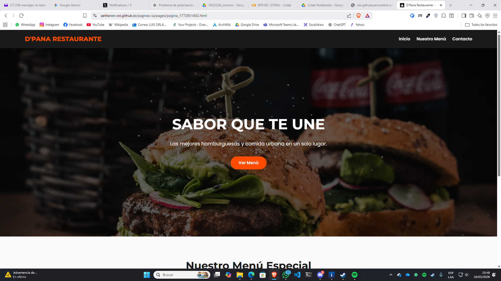
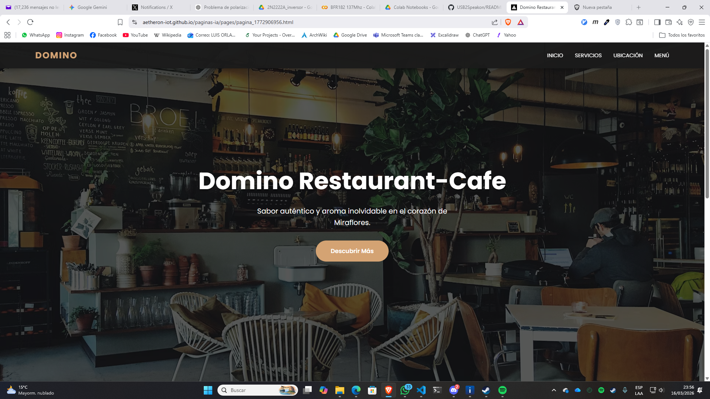
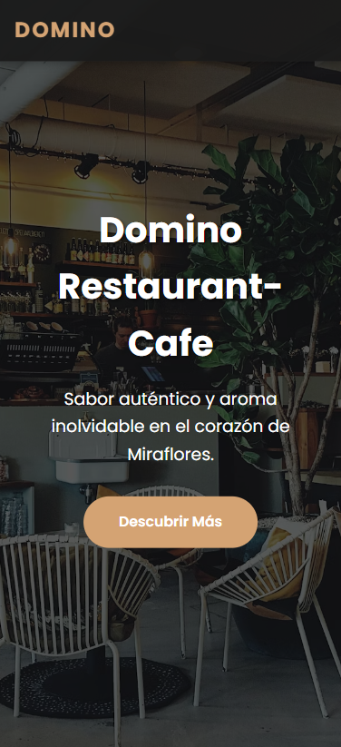
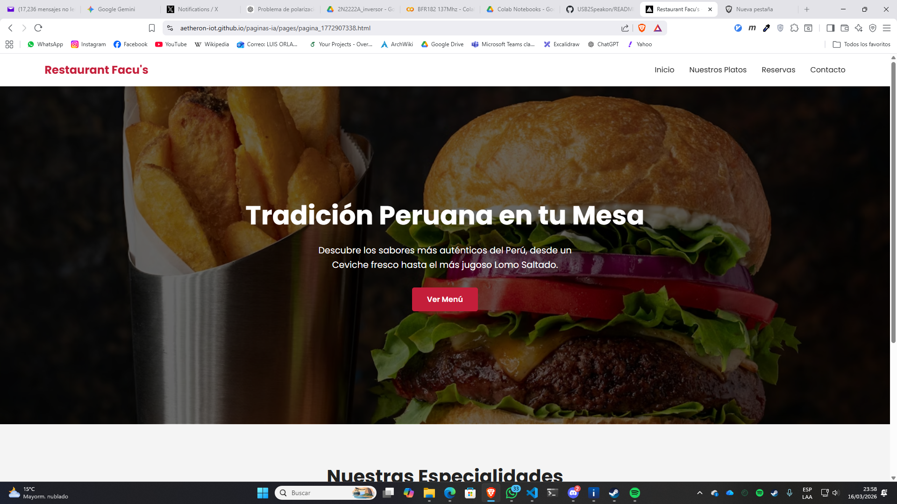
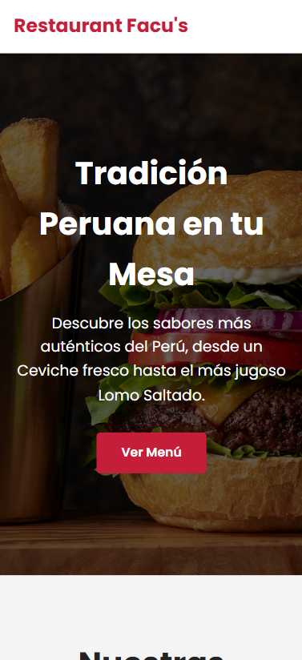
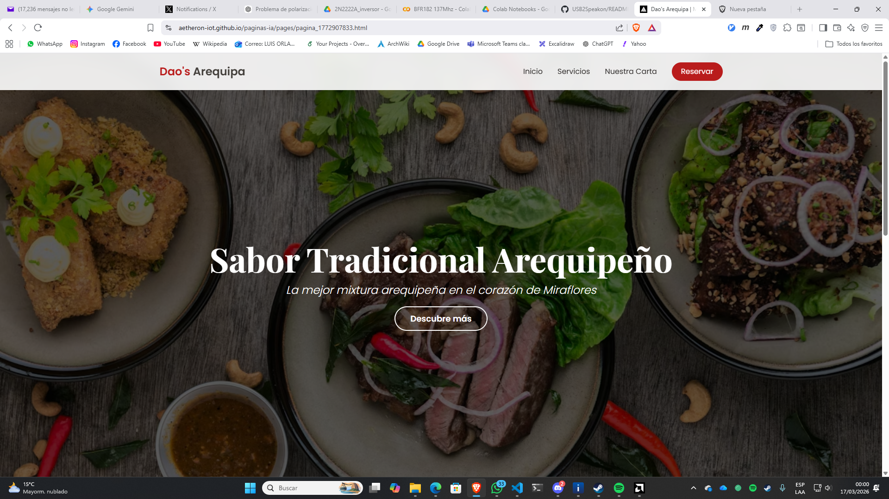
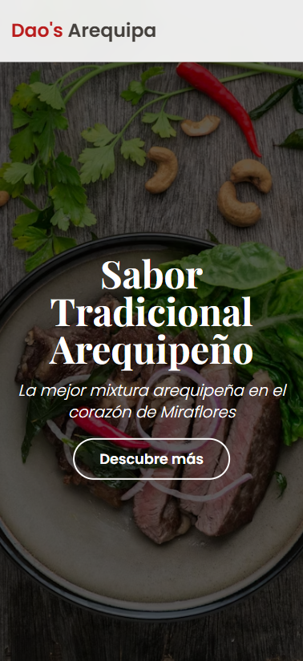

# Paginas Web con IA

Este es un generador de sitios web con IA para Aetheron. Se usa de Gemini AI y
para el back esta en Render.

Este sitio web es accesible desde 
[https://paginas-ia.onrender.com](https://paginas-ia.onrender.com).

De manera local se esta ejecutando en `paginas-ia.local` previa instalacion de nginx y php.

## Nginx

[Descargable](https://drive.google.com/file/d/17GGSOSrpV0eO697wPbncahJscp1zsUrs/view?usp=drive_link)

Version nginx:

    nginx -V
    nginx version: nginx/1.28.2

Iniciar nginx:

    start nginx

Detener nginx:

    nginx -s stop

Recargar nginx:

    nginx -s reload

## PHP

[Descargable](https://drive.google.com/file/d/1C7FaCUhBy3GHtucG2hwFITrD0TMYtS-G/view?usp=drive_link)

Version:

    php -v
    PHP 8.5.3 (cli) (built: Feb 10 2026 18:43:53) (NTS Visual C++ 2022 x64)

Iniciar php:

    php-cgi.exe -b 127.0.0.1:9000

## Paginas html generadas

**D'Pana Restaurante**

&nbsp;

[Demo](https://aetheron-iot.github.io/paginas-ia/pages/pagina_1772851402.html) | [Video](https://youtu.be/PpCuMuFkMDM) | [Video Celular](https://youtube.com/shorts/OiAY-D2cfJ4) 

**Domino Restaurant-Cafe**

&nbsp;

[Demo](https://aetheron-iot.github.io/paginas-ia/pages/pagina_1772906956.html) | [Video](https://youtu.be/Rm4ReBN56Sw) | [Video Celular](https://youtube.com/shorts/otr7UjctvJA)

**Restaurant Facu's**

&nbsp;

[Demo](https://aetheron-iot.github.io/paginas-ia/pages/pagina_1772907338.html) | [Video](https://youtu.be/1NX0V3CXzzQ) | [Video Celular](https://youtube.com/shorts/o6LOuljDbJw)

**Dao's Arequipa**

&nbsp;

[Demo](https://aetheron-iot.github.io/paginas-ia/pages/pagina_1772907833.html) | [Video](https://youtu.be/Qdx8dOqzayo) | [Video Celular](#)
